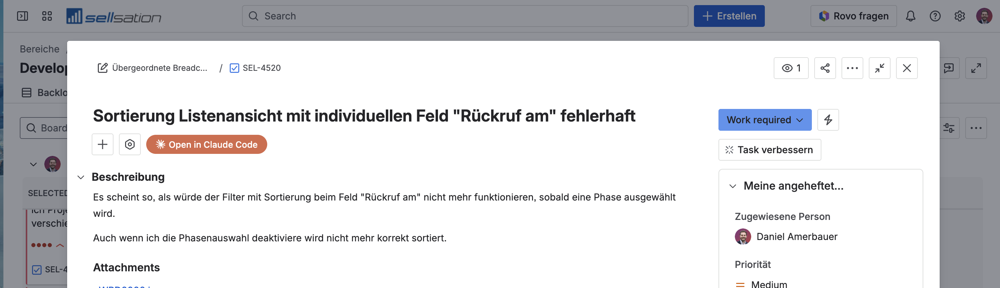
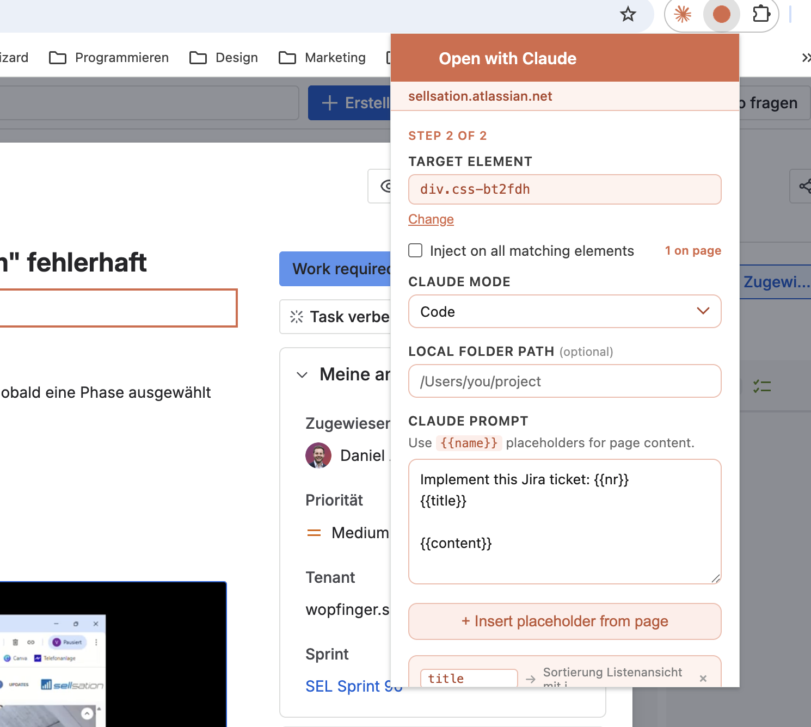

# Open with Claude — Chrome Extension

Inject an **"Open in Claude"** button into any element on any website. When clicked, the button opens Claude Desktop (Code, Chat, or Cowork mode) and pre-fills the prompt with content scraped from the page using configurable placeholders.



---

## Setup in Chrome

1. Clone or download this repository to your local machine.
2. Open Chrome and navigate to `chrome://extensions`.
3. Enable **Developer mode** (toggle in the top-right corner).
4. Click **Load unpacked** and select the repository folder.
5. The "Open with Claude" extension icon appears in your toolbar.

> The extension requires **Claude Desktop** to be installed, as it opens prompts via the `claude://` URL scheme.

---

## How to use

### 1. Open the popup on any page

Click the extension icon in the Chrome toolbar while on the page you want to configure.

### 2. Select a target element (Step 1 of 2)

Click **Set up button** → the page enters pick mode with an orange banner at the top.

- Hover over any element — it highlights with an orange outline.
- Press **S** to select it as the injection target.
- Press **Esc** to cancel.

### 3. Configure the prompt (Step 2 of 2)



| Field | Description |
|---|---|
| **Target element** | The CSS selector where the button is injected. Click **Change** to re-pick. |
| **Inject on all matching elements** | Repeats the button on every matching element on the page (e.g. every card in a list). |
| **Claude mode** | `Code` (opens in Claude Code with a local folder), `Chat` (opens claude.ai), or `Cowork`. |
| **Local folder path** | *(Code / Cowork only)* Absolute path to your project folder, pre-filled in Claude Code. |
| **Claude prompt** | The prompt template sent to Claude. Use `{{name}}` placeholders for live page content. |

### 4. Insert placeholders

Click **+ Insert placeholder from page** → pick any element on the page → its text is mapped to a placeholder token like `{{title}}` that gets inserted at the cursor position in your prompt.

Each placeholder chip shows the live value scraped from the page. Rename the chip key to change the token name.

**Example prompt for a Jira ticket:**

```
Implement this Jira ticket: {{nr}}
{{title}}

{{content}}
```

### 5. Save and use

Click **Save**. The "Open in Claude" button appears directly on the page, injected next to the target element. Click it to open Claude with the fully resolved prompt.

The configuration is stored per hostname and persists across page reloads. Multiple buttons per site are supported — click **+ Add another button** to configure additional injection points.

---

## Managing existing buttons

Open the extension popup on a configured page to:

- See which buttons are **active** (green dot) or not found (grey dot).
- **Edit** a button's prompt, selector, or mode.
- **Remove** a button.
